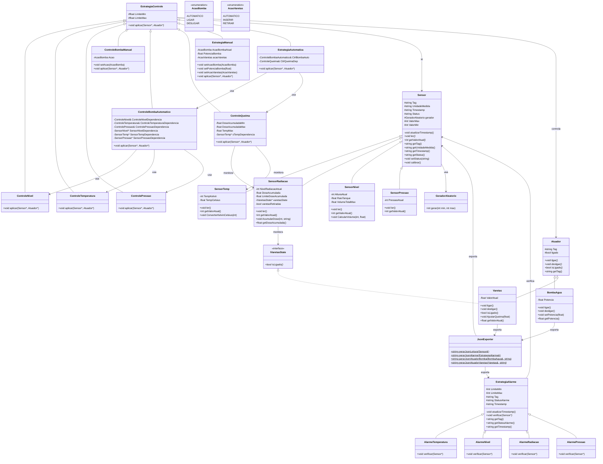

# Reator - Estação de Bombeamente

> Nesse projeto nossa ideia é monitorar e controlar um tanque de água que faz parte de um reator de uma usina nuclear, com base nas leituras dos sensores, os atuadores como bomba e varetas atuam para manter o reator funcial e inteiro

 - **Dispositivo C++:** Simula a leitura de sensores (nível, temperatura, radiação, pressão) e atuadores (varetas e bomba), gerando arquivos JSON (`readings.jl` e `commands.jl`).
- **Backend Python (`db_writer.py`):** Monitora os arquivos gerados pelo C++ e persiste os dados em SQLite.
- **Frontend Streamlit (`app.py`):** Exibe um dashboard interativo com métricas, gráficos históricos, tabelas de alarmes e painel de controle para envio de comandos.

### 1. Camada de Dados e Aquisição (Backend)
- **Componentes:** Simulador C++ e `db_writer.py`.
- **Responsabilidade:** Capturar os dados brutos dos sensores (C++), armazená-los em arquivos `.jl` e, em seguida, consolidá-los em um banco de dados relacional (SQLite) via Python.
- **Tecnologias:** C++, Python, SQLite.

### 2. Camada de Apresentação (Frontend)
- **Componentes:** Aplicação Streamlit (`app.py`).
- **Responsabilidade:** Interface gráfica web. Consulta os dados do `.jl` para exibir gráficos, métricas e tabelas em tempo real. Envia comandos de controle (automático, inserir, retirar) gravando no arquivo `commands.jl` para o C++ processar.
- **Tecnologias:** Streamlit, Pandas.
  

  **Fluxo de Dados:**
`C++ (Simulação)` -> `readings.jl` -> `db_writer.py` -> `SQLite (scada.db)` -> `Streamlit Dashboard`->`commands.jl` -> `C++ (Execução)`.


### Tabela de Limites dos Sensores

A tabela abaixo define os intervalos operacionais e os limites para disparo de alarmes de cada sensor monitorado pelo sistema.

| Sensor | Unidade | Limite Operacional (Mín / Máx) | Alarme Mínimo (Abaixo de) | Alarme Máximo (Acima de) |
| :--- | :--- | :--- | :--- | :--- |
| Nível | m | 0 / 100 | < 30 | > 99 |
| Temperatura | K | 250 / 400 | < 300 | > 350 |
| Radiação | mSv/h | 0 / 50 | < 10 | > 40 |
| Pressao | psi | 0 / 200 | < 10 | > 180 |


---



---
### Contrato JSON – Alarmes

**Exemplo completo de um alarme:**

```json
{
    "tag": "STM-01",
    "tipo": "alarme",
    "status": "ALERTA - TEMPERATURA ALTA",
    "timestamp": "2026-06-27T12:45:10Z"
}
```
**Exemplo completo de um comando:**

```json
{
    "tipo": "comando",
    "tag": "VAR-01",
    "acao": "AUTOMATICO",
    "origem": "supervisor",
    "timestamp": "2026-06-27T13:34:47.640708+00:00"
}
```

### Instruções para Compilar em C++

> Passo a passo para compilar em C++(WSL ou Linux)
- cd MINI-SCADA-DA-ESTA-O-DE-BOMBEAMENTO
- g++ -I dispositivo_cpp/include dispositivo_cpp/src/*.cpp -o meu_programa        `para atualizar o codigo caso tenha mudanças`
- ./meu_programa `para rodar o C++`


### instruções para executar Streamlit
> Passo a passo para rodar o Streamlit
- cd MINI-SCADA-DA-ESTA-O-DE-BOMBEAMENTO
- python3 -m venv .venv
- source .venv/bin/activate
- pip instal -r requirements.txt
- streamlit run supervisor_python/app.py `abra o link gerado`

### instruções para executar o Banco de Dados
>Passo a passo para rodar o Banco de Dados
- cd MINI-SCADA-DA-ESTA-O-DE-BOMBEAMENTO/supervisor_python
- python3 db_writer.py


### instruções para testes
> Os testes foram criados em formado CI, usando um yml para rodar automaticamente no GitHub Actions


### assinatura operacional da dupla
> Nosso ID da dupla é 03, com isso nos nomeamos todos os sensores para -03, e a falha critica acontece quando a dose de radiação chega em 300

### divisão de responsabilidades

> Jose davi: Responsavel pela parte de C++, fazer o main e as Estrategias de controle

>Leandro: Responsavel pelo supervisorio e os banco de dados

### decisões de padrões de projeto
> Strategy e Observer.

### limitações conhecidas
- Nosso codigo roda de forma bem imediata, do tipo: 
- leitura(sensores) -> estrategia de controle -> ação(atuadores)
- e fica nesse ciclo infinito, onde a leitura anterior não exatamente interfere na proxima leitura,por conta de todas as leituras serem geradas aleatoriamente, exeto a dose de radiação que vai acumulando ou dissipando com o tempo.
  
